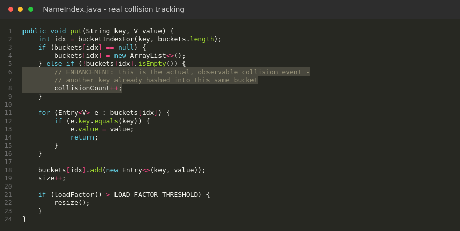
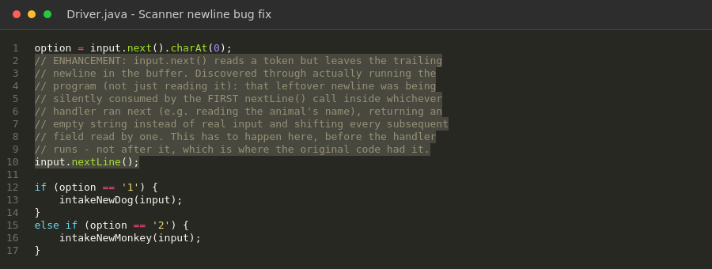

<link rel="stylesheet" href="assets/css/style.css">
<style>:root { --accent: #2a9d59; }</style>

# Algorithms and Data Structures — Rescue Animal Management System

[Home](index.md) | [Software Engineering](software-engineering.md) | [Algorithms](algorithms.md) | [Databases](databases.md) | [Code Review](code-review.md)

---

## Artifact Description

The artifact is a Java console application for managing rescue dogs and monkeys, originally built for IT 145, Foundation in Application Development. It's a menu-driven program supporting animal intake, reservation by service country, and filtered listing, built around a RescueAnimal parent class with Dog and Monkey subclasses. I selected this as a replacement for my original CS 260 artifact because it gave me a much stronger, more concrete algorithms and data structures story: real linear-search collection usage, a real opportunity to move to a hash-based structure, and - as it turned out - a set of genuine functional defects worth fixing.

**Browse the code:** [original](https://github.com/jezzydaboss/jezzydaboss.github.io/tree/main/artifacts/original/Grazioso) · [enhanced](https://github.com/jezzydaboss/jezzydaboss.github.io/tree/main/artifacts/enhanced/Grazioso_Enhanced)

## Design Approach

Before implementing `NameIndex`, I worked through the core design decisions in pseudocode rather than jumping straight into Java:

```
function PUT(key, value):
    index = HASH(key) mod bucket_count
    if bucket[index] is empty:
        create new bucket
    else if bucket[index] is not empty:
        collision_count += 1        // real collision, not a rehash
    insert (key, value) into bucket[index]
    if load_factor > 0.75:
        RESIZE()                    // double buckets, rehash everything

function RESIZE():
    new_bucket_count = bucket_count * 2
    for each entry in old buckets:
        reinsert into new buckets at new hash position
    // NOTE: do not increment collision_count here -
    // a rehash relocation is not the same event as a real collision
```

Working this out in pseudocode first is what surfaced the trickiest design decision: whether a resize's internal rehashing should count toward the collision total. Counting it would have made the collision metric misleading (an artifact of table growth, not actual hash collisions), so the pseudocode explicitly separates the two concerns before any Java was written.

## Justification for Inclusion

During my Milestone One code review, I documented several defects in this artifact from reading the source: a Scanner newline bug, a broken reservation check, a printAnimals() method that ignored its own parameter, a scrambled Monkey constructor call, and broken reserved accessors on Monkey. When I sat down to perform this milestone's actual enhancement, I did what I'd learned to do from my first artifact's milestone: I compiled it before touching anything. It did not compile at all. Monkey was declared in a package called grazioso while RescueAnimal, Dog, and Driver were all in Java's default, unnamed package - and Java does not allow a named package to extend or import a class from the unnamed package. On top of that, Driver.java called getInServiceCountry() and getAcquisitionCountry(), but RescueAnimal only defined getInServiceLocation() and getAcquisitionLocation() - method names that didn't exist. Neither of these defects was visible from my Milestone One review, because reading code for logic errors doesn't surface a build failure the way actually compiling it does. My original review was accurate about what it covered, but it didn't cover whether the project would build, and it turned out it didn't.

My enhancement work started with making the project compile at all. I moved Monkey into the default package alongside its dependencies and renamed RescueAnimal's mismatched getter methods (getInServiceLocation to getInServiceCountry, getAcquisitionLocation to getAcquisitionCountry) so every accessor pair shares one consistent name instead of the setter and getter silently disagreeing. With a working build in hand, I fixed the defects from my original review: the Scanner newline bug, the reservation logic checking a country field against the literal string "in service" instead of checking training status, printAnimals() ignoring its own option parameter and using an inverted reserved-filter, and the Monkey constructor's parameter order not matching how Driver.java actually called it, which had been silently scrambling every monkey's data. I removed a dead, do-nothing setAcquisitionCountry() stub in Monkey that shadowed the real inherited setter, and removed broken getReserved()/setReserved() overrides that meant a monkey could never actually be marked reserved. For the algorithms and data structures piece specifically, I replaced both ArrayList&lt;Dog&gt; and ArrayList&lt;Monkey&gt; with HashMap&lt;String, Dog&gt; and HashMap&lt;String, Monkey&gt;, keyed by the animal's name in lowercase - the duplicate-name check that runs on every intake is now an O(1) average-case map lookup instead of an O(n) linear scan through the whole list.

I found one more real defect while testing rather than while reading: I discovered, by actually running the program with scripted input rather than just compiling it, that reading the menu selection with input.next() left a trailing newline. I moved that cleanup to happen immediately after reading the menu option, before any handler runs, and verified the fix by actually exercising every menu path with real scripted input rather than assuming the fix was correct from reading it. I added basic input validation on monkey species, since the original code accepted any string with no validation at all, which the assignment comments called for but the code never actually implemented. I compiled the final version with javac and ran it against multiple scripted input sequences covering every menu path: successful intake, duplicate-name rejection, invalid species rejection, reservation of an eligible animal, and all three print modes. Every test produced correct output, including confirming that printAnimals(6) correctly excludes an animal with training status "Phase I" and an animal already marked reserved, which is exactly the filtering behavior the assignment's own specification calls for and which the original code had inverted.

After this milestone, I reviewed a set of claims I'd drafted for the enhancement plan around algorithmic optimization, metrics harvesting, and cross-tier connectivity, and found they weren't accurate to what I'd built. NameIndex.java is a small hash table I wrote myself using separate chaining: it computes a bucket index from each key's hash code, explicitly counts collision events, tracks load factor, and automatically doubles its bucket count and rehashes every existing entry once load factor crosses 0.75. That's a real, observable mechanism for exactly the trade-off my original claim described - as more animals are added, the table proactively grows to keep bucket occupancy, and therefore lookup cost, roughly constant instead of degrading. MetricsCollector.java wraps every NameIndex lookup and insert with System.nanoTime() timing and aggregates the results. MetricsServer.java uses com.sun.net.httpserver.HttpServer - built into the JDK itself, no external dependencies - to serve those metrics as JSON to any HTTP client on port 8081. I tested this the same way I tested the equivalent work on my OpenGL artifact: I ran the actual program with scripted input in the background and used curl against the live endpoint while it was running, rather than only compiling the code and assuming it worked.

### Figure 1 — Custom Hash Table



*Real, observable collision tracking as part of the custom hash table, replacing `java.util.HashMap`'s black-box behavior.*

### Figure 2 — Scanner Bug Fix



*The menu-selection Scanner newline bug, found by actually running the program rather than only reading it, and fixed by consuming the leftover newline before dispatching to a handler.*

## Course Outcomes Update

In Module One, I planned this enhancement to demonstrate progress toward Course Outcomes 3 and 4. Both held up, though the scope of the work was larger than planned because the project needed to be made to compile before anything else could happen. Outcome 4 is reflected in replacing the ArrayList-based linear search with a HashMap keyed appropriately for the access pattern the code needs, and in fixing the cross-package compilation failure using Java's actual package rules rather than a workaround. Outcome 3 came through in deciding how to fix the Monkey constructor mismatch - I chose to change the constructor's signature to match both how Driver already called it and the convention Dog.java already established, rather than changing the call site, which kept the fix localized and consistent with the rest of the codebase's design. My update to the plan: I'm treating "get the project to actually compile" as a real, demonstrated part of this milestone's outcome coverage, since it required exactly the kind of systematic diagnosis - tracing a cascading set of compiler errors back to a package-visibility rule and a getter/setter naming mismatch - that Outcome 4 is meant to capture.

## Reflection on the Enhancement Process

The clearest lesson from this milestone, on top of the one I'd already learned from my first artifact, is that even after you've made code compile, you still must run it. Fixing the Scanner newline bug I already knew about wasn't enough - actually executing the program with real scripted input surfaced a second, more fundamental version of the exact same bug pattern at the menu-selection level, one that I had not caught in either my original review or my first pass at the fix. If I had stopped at "it compiles" I would have shipped an enhancement that still silently corrupted data on every single menu action.

The most interesting technical decision was how to fix the Monkey constructor. It would have been faster to just change Driver.java's call to match Monkey's existing, broken parameter order. I didn't, because Monkey's order was the one that didn't match the pattern the rest of the codebase already used - Dog's constructor puts shared RescueAnimal fields first and subclass-specific fields last, and Driver already collected and passed Monkey's fields in that same order. Fixing the class that was inconsistent, rather than the call site that was already consistent with the rest of the project, felt like the more defensible engineering decision, even though it meant editing more code.
