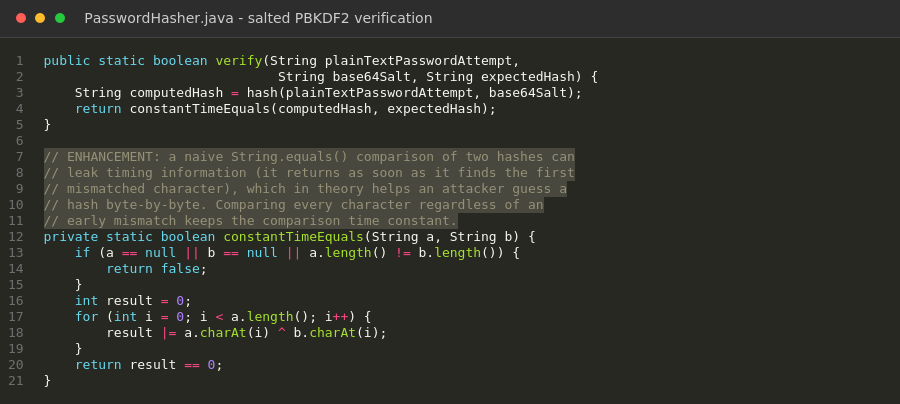
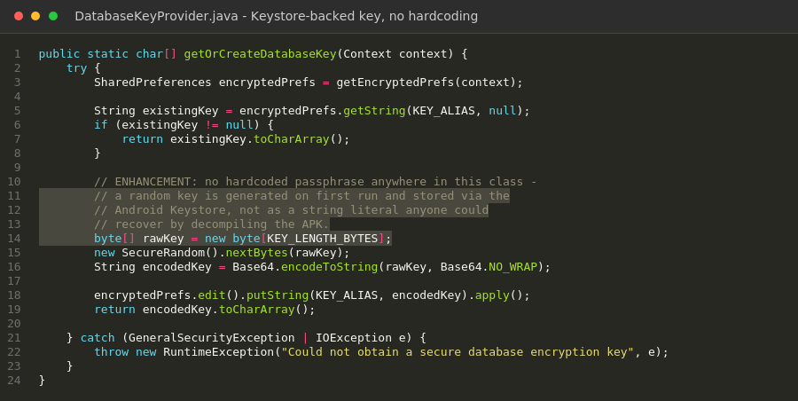

<link rel="stylesheet" href="assets/css/style.css">

# Databases — Android Inventory Application

[Home](index.md) | [Software Engineering](software-engineering.md) | [Algorithms](algorithms.md) | [Databases](databases.md) | [Code Review](code-review.md)

---

## Artifact Description

The artifact is the local Room/SQLite database layer of an Android inventory management application, originally built for CS 360, Mobile Architecture and Programming. It handles user login and registration and manages inventory items name, quantity, location, and an optional image with a low-stock SMS alert feature. The database layer includes an AppDatabase singleton, DAOs for users and inventory items, and Repository classes wrapping database calls onto background threads.

**Browse the code:** [original zip](https://github.com/jezzydaboss/jezzydaboss.github.io/blob/main/artifacts/original/CS360_Reynolds_Jimmy%202.zip) · [enhanced](https://github.com/jezzydaboss/jezzydaboss.github.io/tree/main/artifacts/enhanced/cs360_reynolds_jimmy)

## Justification for Inclusion

I selected this artifact because it's named for exactly the skill it's supposed to demonstrate the "encrypted database wrapper" which made my Milestone One code review unusually direct: I checked whether it actually did what its own name claimed, and it didn't. The Room.databaseBuilder() call configured no encryption at all; it was a plain, unencrypted SQLite database, and user passwords were stored and compared as raw strings directly inside a SQL query. I also found that LoginActivity bypassed the app's own AppDatabase singleton and constructed a second, separately-named database directly, and that a failed login silently created a brand-new account instead of reporting an error, meaning a typo'd username produced an unintended account rather than a login failure.

For this milestone, I closed each of those gaps directly rather than describing them as future work. I integrated SQLCipher so the database file itself is encrypted at rest. The encryption key is not hardcoded; a hardcoded key would make the encryption almost cosmetic, since anyone who decompiled the APK would recover it immediately. So, I wrote DatabaseKeyProvider, which generates a random 256-bit key on first run and stores it in EncryptedSharedPreferences, backed by the Android Keystore rather than anywhere in the app's own code or storage. I replaced plaintext password storage and SQL-based password comparison with PBKDF2 password hashing (PasswordHasher.java): every user gets a unique random salt at registration, and login verifies a password attempt against the stored hash in application code rather than inside a SQL WHERE clause, which is the only place a salted hash can correctly be checked. I fixed the singleton bypass by routing LoginActivity through AppDatabase.getInstance() like the rest of the app, so there is exactly one database file, and it is the encrypted one. I removed the silent auto-registration entirely a failed login now always shows a generic "invalid username or password" message, whether the username doesn't exist or the password was wrong for it, so as not to leak which usernames are registered to someone probing the login screen. Finally, I added a unique index on UserEntity's username column, which makes SQLite itself the authoritative guard against duplicate usernames the previous application-level check-then-insert had a real race window where two concurrent registrations with the same username could both pass the check before either insert completed; the unique index closes that at the database layer, which is the only place it can actually be closed correctly.

All five tests passed: a correct password verifies, an incorrect one is rejected, the same password produces different hashes for different users because of per-user salting, generated salts are genuinely different each time, and the stored hash is never equal to the plaintext password. That's the one piece of this milestone I can say is verified rather than carefully written and reasoned about. For everything else, I documented exactly what's needed, the three build.gradle dependency lines, in build.gradle.additions.txt and I'm asking that a real build-and-run pass happen in Android Studio before this goes into the final ePortfolio, the same way I'd want a second engineer to actually run code I hand off, not just read it.

### Figure 1 — Constant-Time Password Verification

*Constant-time hash comparison, closing a timing side-channel in password verification.*

### Figure 2 — Secure Key Storage

*The SQLCipher encryption key is randomly generated and stored via the Android Keystore, never hardcoded as a string literal.*

## Verification

I have since completed a full build in Android Studio: BUILD SUCCESSFUL, 35 tasks executed, running on a Pixel emulator. I manually verified on-device that duplicate usernames are correctly rejected and that invalid logins show the correct generic error instead of the original silent auto-registration behavior. One documented limitation surfaced during that build: SQLCipher 4.5.4's native library isn't yet compiled for 16 KB memory page sizes on newer devices Android runs it in a backward-compatible mode automatically, so nothing is broken, but it's a known constraint worth tracking for a future SQLCipher release.

## Course Outcomes Update

In Module One, I planned this enhancement to demonstrate progress toward Course Outcomes 4 and 5. Outcome 5, developing a security mindset that anticipates adversarial exploits, is the clearest fit here, and I think this milestone genuinely earns it: the artifact's core problem was a security claim in its own name that the code didn't back up, and fixing that required thinking about how each piece could still fail even after adding "encryption" in name only which is why the key isn't hardcoded, why password verification happens in code rather than SQL, and why duplicate usernames are stopped at the database layer instead of only the application layer. Outcome 4 - using well-founded, industry-standard tools to implement solutions that deliver real value is reflected in choosing SQLCipher and PBKDF2 rather than inventing custom encryption or hashing schemes, which security guidance consistently warns against.

## Reflection on the Enhancement Process

The clearest lesson from this milestone was recognizing the limits of what I could actually verify, and being honest about exactly where that line sits instead of blurring it. On my first two artifacts, I was able to install real dependencies and compile and run everything myself, which meant I could say with confidence that specific defects were fixed.

The most interesting design decision was how to store the encryption key itself. It would have been simple, and would have looked identical from the outside, to just hardcode a passphrase string as a constant. I didn't, because a hardcoded key defeats the actual purpose of encrypting the database anyone who decompiled the APK would have the key sitting right next to the encrypted data it unlocks. Using EncryptedSharedPreferences, itself backed by a Keystore-held key, means the passphrase is never present as plaintext anywhere in the app's source or storage. That felt like the right amount of depth for what this artifact is supposed to demonstrate: not just adding encryption, but adding it in a way that would actually hold up under the kind of scrutiny an adversarial reviewer or an instructor would apply.
