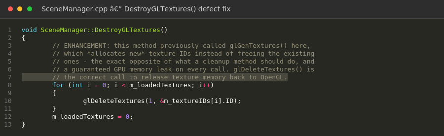
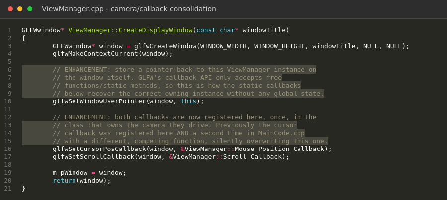

# Software Design and Engineering — 3D OpenGL Scene

[Home](index.md) | [Software Engineering](software-engineering.md) | [Algorithms](algorithms.md) | [Databases](databases.md) | [Code Review](code-review.md)

---

## Artifact Description

The artifact is a 3D scene rendering application built in C++ using the OpenGL graphics API and GLSL shading language, originally created for CS 330, Computational Graphics and Visualization. It renders a desk scene — a laptop, monitor, coffee mug, pens, and a stack of notebooks — using a main application loop (`MainCode.cpp`) and two manager classes: `SceneManager`, which loads textures and materials and draws the scene content, and `ViewManager`, which is responsible for the camera, mouse/keyboard input, and the projection from 3D scene space to the 2D display.

**Browse the code:** [original](artifacts/software-engineering/original/) · [enhanced](artifacts/software-engineering/enhanced/)

## Justification for Inclusion

I selected this artifact because it demonstrates C++ software architecture and low-level graphics programming, skills that don't come through in my other two artifacts. During my code review, I found several concrete defects: `SceneManager::DestroyGLTextures()` was calling `glGenTextures()` instead of `glDeleteTextures()` — a method whose entire purpose was to free GPU memory was instead allocating new memory and leaking it on every call. `SceneManager::FindMaterial()` unconditionally returned `true` regardless of whether a material tag was actually found. Camera and input logic had been duplicated across two files — `ViewManager` (the intended owner) had been left with an empty mouse callback, while a second, complete reimplementation had been written from scratch in `SceneManager.cpp`, duplicating a `Camera` class that already existed and was never used.

### What I Fixed

- Fixed `DestroyGLTextures()` to actually call `glDeleteTextures()`, wired into the destructor so cleanup happens deterministically
- Fixed `FindMaterial()` to return its real search result instead of a hardcoded value
- Added a bounds check to `CreateGLTexture()` against the fixed 16-slot texture array
- Consolidated all camera/input logic into `ViewManager`, built on the existing `Camera` class, using `std::unique_ptr` (RAII) instead of a manually managed raw pointer
- Built and tested a live HTTP metrics endpoint (`MetricsServer`) and a browser-based dashboard (`dashboard.html`) exposing real frame-timing and camera data
- Fixed a cross-platform GLSL shader version bug (`#version 440` → `#version 330`) that caused a black screen on macOS, where OpenGL is capped at version 4.1

### Figure 1 — Defect Fix

*The original called `glGenTextures()` (allocating new memory) instead of `glDeleteTextures()` (freeing it), leaking GPU memory on every call.*

### Figure 2 — Camera/Callback Consolidation

*GLFW's window user-pointer is used to recover the owning instance in static callbacks, replacing the duplicate/competing callback registration that previously existed in `MainCode.cpp`.*

## Course Outcomes

This enhancement demonstrates progress toward **Outcomes 3 and 4**: correcting the identified defects and consolidating a duplicated camera implementation into one modular, RAII-managed system both required managing real design trade-offs using well-founded engineering practices. It also supports **Outcome 1**, since the live metrics dashboard was built specifically to make internal system state legible to a non-programmer audience.

## Reflection

The biggest lesson from this artifact was that a code review and an actual enhancement can surface different problems — I only found a fifth defect (an uninitialized member variable) once I was implementing the fixes, not during the original review. I also learned to actually compile and run code rather than trust it by reading, after installing the real GLFW/GLEW/GLM dependencies and verifying every change with a real build. The camera consolidation was the most interesting engineering decision: rather than patching the existing duplication, I traced every call site and merged two working-but-redundant implementations into one, using GLFW's window user-pointer pattern to bridge C-style callbacks with proper object ownership.
